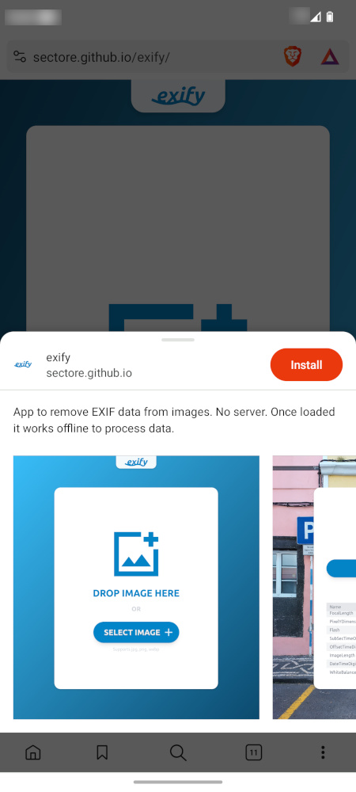
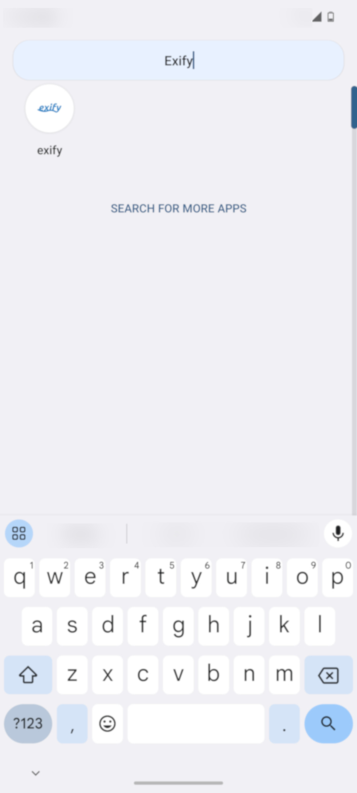
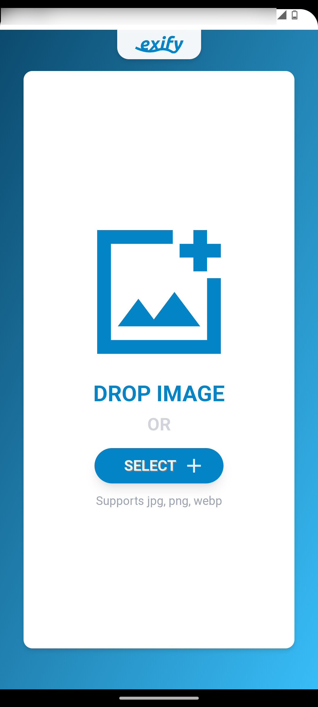

# `exify`

Progressive Web App (PWA) to remove [EXIF](https://en.wikipedia.org/wiki/Exif) (Exchangeable Image File Format) data from images.

<p float="left">
  <a href="assets/exify-1.png">
    
  </a>
  <a href="assets/exify-2.png">
    
  </a>
  <a href="assets/exify-3.png">
    
  </a>
</p>

 
## Features

- Client-side image processing
- No server
- No data is sent anywhere
- Mobile support
- Once loaded it works offline to process data
- Free open source software (MIT License)


## Mobile app

- Open https://sectore.github.io/exify/ in your browser. 
- Install the application from the browser menu by clicking "Install app".
- After installing `exify`, you can start it just as you would with any other app.

<p float="left">
  <a href="templates/exify-install-1.jpg">
    
  </a>
  <a href="templates/exify-install-2.jpg">
    
  </a>
  <a href="templates/exify-install-3.jpg">
    
  </a>
</p>

## Desktop

Open https://sectore.github.io/exify/ in your browser. 


## Development

### Prerequisites

#### Nix (recommended)

Install [Nix](https://zero-to-flakes.com/install)

#### Other

Install [Rust](https://www.rust-lang.org/tools/install) and [Trunk](https://trunkrs.dev/)


### Build from source

`cd` into the project directory and run:

### Nix

```bash
nix develop
trunk build --release
```

### Or others

```bash
trunk build --release
```


### Developing locally

`cd` into the project directory and run:

### Nix

```bash
nix develop
trunk serve
```

### Or others

```bash
trunk serve
```

Open browser at http://127.0.0.1:8080/exify

## FAQ

### What does `exify` mean?

The name `exify` is derived from EXIF, the file format used to store metadata in images.

### Do I need an Internet connection?

No. The application works offline.

### What happens to my original images?

Original images will be unchanged. All changes will be saved as a new image prefixed with `exify-`.

### How does `exify` work?

Technically the application is built with [Yew](https://yew.rs/) / ([Rust](https://www.rust-lang.org/)) and compiled to [WebAssembly](https://webassembly.org/). It uses [kamadak-exif](https://crates.io/crates/kamadak-exif) and [img-parts](https://crates.io/crates/img-parts) crates to parse and remove EXIF data from images.

All code runs in the browser. No server is needed. 

### What browsers are supported?

All modern browsers.

### Does it work for mobile devices?

Yes. The application works on mobile devices. Once installed from browser, it can be started from the home screen of your device.

### What image formats are supported?

`jpg`, `png` and `webp` formats are supported.

### What metadata is removed?

All EXIF data recognized by the application will be removed.

### Is this application free?

Yes. The source code is available on GitHub under the MIT license.

### How can I contribute?

You can contribute by reporting bugs, suggesting features or by submitting pull requests.


## License

[MIT Lizenz](./LICENSE)
